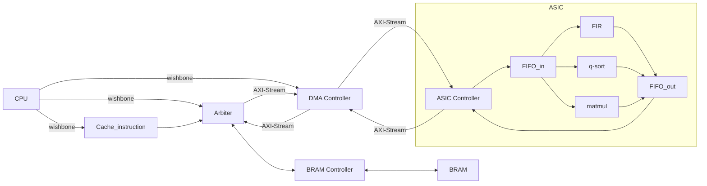
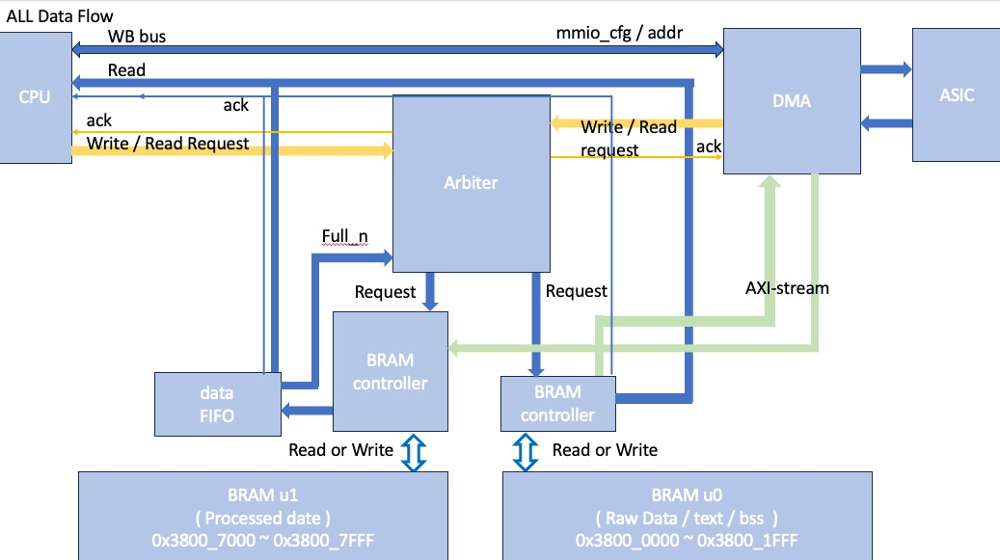

# 112 SOC Lab - Final Project


## Outline
- [112 SOC Lab - Final Project](#112-soc-lab---final-project)
  - [Outline](#outline)
  - [1. System](#1-system)
    - [1.1 System Architecture](#11-system-architecture)
    - [1.2 Data Flow](#12-data-flow)
  - [2. Simulation](#2-simulation)
  - [2.1 RTL](#21-rtl)
  - [2.2 Synthesis/Implementation](#22-synthesisimplementation)
  - [3. Result](#3-result)
    - [3.1 Command Line](#31-command-line)
    - [3.2 Waveform](#32-waveform)
  - [4. About Project](#4-about-project)
    - [4.1 Memory Map](#41-memory-map)
    - [4.2 Checkbits](#42-checkbits)
    - [4.3 DMA Config](#43-dma-config)
    - [4.4 UART Config](#44-uart-config)
    - [4.4 Linker Script](#44-linker-script)
    - [4.5 Arbiter Priority](#45-arbiter-priority)
    - [4.6 Transfer Protocol](#46-transfer-protocol)
      - [4.6.0 Naming Abbreviation](#460-naming-abbreviation)
      - [4.6.1 DMA/brc0](#461-dmabrc0)
      - [4.6.2 DMA/ASIC](#462-dmaasic)

## 1. System
### 1.1 System Architecture


### 1.2 Data Flow


---

## 2. Simulation
## 2.1 RTL
1. generate project firmware and simulation on vivado
    ``` bash=
      cd ~/testbench
      make
    ```

## 2.2 Synthesis/Implementation
1. generate bitstream/hardware handoff files
    ``` bash=
    cd ~/vivado
    make
    ```
2. upload files on online FPGA
    ``` bash=
    cp ./vivado/jupyter_notebook/* onlineFPGA
    # Run caravel_fpga.ipynb
    ```

## 3. Result
### 3.1 Command Line
``` text=
make[1]: Entering directory '~/testbench'
make[1]: Leaving directory '~/testbench'
Reading main.hex
main.hex loaded into memory
Memory 5 bytes = 0x6f 0x00 0x00 0x0b 0x13
VCD info: dumpfile main.vcd opened for output.
Times = 1/3 - UART
Times = 1/3 - Hardware
tx_data[0] = 1'b0
tx_data[1] = 1'b0
tx_data[2] = 1'b0
tx_data[3] = 1'b0
tx_data[4] = 1'b0
tx_data[5] = 1'b0
tx_data[6] = 1'b0
tx_data[7] = 1'b0
tx complete - data: 8'd000, 8'h00
Times = 2/3 - UART
tx_data[0] = 1'b1
tx_data[1] = 1'b0
Test start - FIR
Test end   - FIR
Test start - matmul
tx_data[2] = 1'b0
Test end   - matmul
Test start - qsort
Test end   - qsort
Times = 2/3 - Hardware
tx_data[3] = 1'b0
Test start - FIR
Test end   - FIR
Test start - matmul
Test end   - matmul
Test start - qsort
tx_data[4] = 1'b0
Test end   - qsort
Times = 3/3 - Hardware
Test start - FIR
tx_data[5] = 1'b0
Test end   - FIR
Test start - matmul
Test end   - matmul
Test start - qsort
tx_data[6] = 1'b0
Test end   - qsort
tx_data[7] = 1'b0
tx complete - data: 8'd001, 8'h01
Times = 3/3 - UART
tx_data[0] = 1'b0
tx_data[1] = 1'b1
tx_data[2] = 1'b0
tx_data[3] = 1'b0
tx_data[4] = 1'b0
tx_data[5] = 1'b0
tx_data[6] = 1'b0
tx_data[7] = 1'b0
tx complete - data: 8'd002, 8'h02
main_tb.v:80: $finish called at 3593727000 (1ps)
```

### 3.2 Waveform

## 4. About Project
### 4.1 Memory Map 
|  Base   |   End   |   Hardware   |    Description    |
|---------|---------|--------------|-------------------|
|3800_0000|3800_04FF|BRAM_u0       |Initialized datas  |
|3800_1000|3800_1FFF|BRAM_u0       |RISC-V Instructions|
|3800_7000|3800_7FFF|BRAM_u1       |Calculated Result  |
|3000_8000|3000_8000|DMA_Controller|DMA_cfg            |
|3000_8004|3000_8004|DMA_Controller|DMA_addr           |
|3100_0000|3100_0000|uart_ctrl     |RX_DATA            |
|3100_0004|3100_0004|uart_ctrl     |TX_DATA            |
|3100_0008|3100_0008|uart_ctrl     |STAT_REG           |


### 4.2 Checkbits
``` verilog
  // ~/testbench/main_tb.v
  assign checkbits = mprj_io[31:16];
```

|checkbits|Hardware|Meaning                                               |
|:-------:|:------:|------------------------------------------------------|
|16'hAB00 |FIR     |testbench has received CPU - FIR start signal         |
|16'hAB01 |FIR     |testbench has received CPU - FIR end signal           |
|16'hAB10 |matmul  |testbench has received CPU - matmul start signal      |
|16'hAB11 |matmul  |testbench has received CPU - matmul end signal        |
|16'hAB20 |qsort   |testbench has received CPU - qsort start signal       |
|16'hAB21 |qsort   |testbench has received CPU - qsort end signal         |
|16'hAB30 |FIR     |testbench has received CPU - FIR_check start signal   |
|16'hAB31 |FIR     |testbench has received CPU - FIR_check end signal     |
|16'hAB40 |matmul  |testbench has received CPU - matmul_check start signal|
|16'hAB41 |matmul  |testbench has received CPU - matmul_check end signal  |
|16'hAB50 |qsort   |testbench has received CPU - qsort_check start signal |
|16'hAB51 |qsort   |testbench has received CPU - qsort_check end signal   |


### 4.3 DMA Config
``` text
         +------+------+-------+------+---------+--------+
DMA_cfg  | done | idle | start | type | channel | length |
         | [12] | [11] | [10]  | [9]  |  [8:7]  |  [6:0] |
         +------+------+-------+------+---------+--------+
DMA_addr |                addr_DMA2RAM                   |
         |                   [12:0]                      |
         +-----------------------------------------------+
```
### 4.4 UART Config
```
         +-------------------------------------------------------------------+
RX_DATA  |                             DATA BITS                             |
         |                               [7:0]                               |
         +-------------------------------------------------------------------+
TX_DATA  |                             DATA BITS                             |
         |                               [7:0]                               |
         +-----------+-------------+---------+----------+---------+----------+
STAT_REG | Frame Err | Overrun Err | Tx_full | Tx_empty | Rx_full | Rx_empty |
         |    [5]    |     [4]     |   [3]   |   [2]    |   [1]   |   [0]    |
         +-----------+-------------+---------+----------+---------+----------+
```

### 4.4 Linker Script
File : [Linker Script](./firmware/sections.lds)
``` ld
MEMORY {
	vexriscv_debug : ORIGIN = 0xf00f0000, LENGTH = 0x00000100
	dff            : ORIGIN = 0x00000000, LENGTH = 0x00000400
	dff2           : ORIGIN = 0x00000400, LENGTH = 0x00000200
	flash          : ORIGIN = 0x10000000, LENGTH = 0x01000000
	mprj           : ORIGIN = 0x30000000, LENGTH = 0x00100000
	rawdata        : ORIGIN = 0x38000000, LENGTH = 0x00000500
	mprjram        : ORIGIN = 0x38001000, LENGTH = 0x00001000
	hk             : ORIGIN = 0x26000000, LENGTH = 0x00100000
	csr            : ORIGIN = 0xf0000000, LENGTH = 0x00010000
}
```

### 4.5 Arbiter Priority
  1. CPU_Write_u0 (Initialized datas/instruction)
  2. DMA_Read_u0 (Initialized datas)
  3. CPU_Burst_Read_Instruction (instrcution cache prefetch)
  4. CPU_Read_u0 (Calculated Result)
  5. Arbiter_Idle (Exception)

### 4.6 Transfer Protocol
#### 4.6.0 Naming Abbreviation
  - dma  : DMA controller
  - brc0 : BRAM controller u0 
  - brc1 : BRAM controller u1 
  - abt  : Arbiter
  - d0   : data0
  - d1   : data1
  - a0   : addr0
  - a1   : addr1

#### 4.6.1 DMA/brc0
1. DMA Read data from BRAM_u0
    > BRAM controller u0 -> DMA controller

   -  Arbiter is idle
   ``` text
                   0  1  2  3  4  5  6  7  8  9 10 11 12 13 14 15 16 17 18 19 20 21 22 23 24 25
   clk             |  |  |  |  |  |  |  |  |  |  |  |  |  |  |  |  |  |  |  |  |  |  |  |  |  |
   dma_r_addr      ___/a0|a1|a2|a3|a4|a5|a6|a7|a8|a9|aA|aB\____________________________________
   dma_r_ready     ___/‾‾‾‾‾‾‾‾‾‾‾‾‾‾‾‾‾‾‾‾‾‾‾‾‾‾‾‾‾‾‾‾‾‾‾\____________________________________
   abt_r_ack       ___/‾‾‾‾‾‾‾‾‾‾‾‾‾‾‾‾‾‾‾‾‾‾‾‾‾‾‾‾‾‾‾‾‾‾‾\____________________________________
   brc0_out_valid  _________________________________/‾‾‾‾‾‾‾‾‾‾‾‾‾‾‾‾‾‾‾‾‾‾‾‾‾‾‾‾‾‾‾‾‾‾‾\______     
   brc0_data_out   _________________________________/d0|d1|d2|d3|d4|d5|d6|d7|d8|d9|dA|dB\______
                     |<-----------10T------------->|
   minimun latency : 10T
   < if add a cache at DMA can reduce the latency to 1T , maybe could implement 0T ! >
   ```

   -  Arbiter is busy
   ``` text
                   0  1  2  3  4  5  6  7  8  9 10 11 12 13 14 15 16 17 18 19 20 21 22 23 24 25
   clk             |  |  |  |  |  |  |  |  |  |  |  |  |  |  |  |  |  |  |  |  |  |  |  |  |  |
   dma_r_addr      ___/‾a0‾‾|a1|a2|a3|a4|a5|a6|a7|a8|a9|aA|aB\_________________________________
   dma_r_ready     ___/‾‾‾‾‾‾‾‾‾‾‾‾‾‾‾‾‾‾‾‾‾‾‾‾‾‾‾‾‾‾‾‾‾‾‾‾‾‾\_________________________________
   abt_r_ack       _________/‾‾‾‾‾‾‾‾‾‾‾‾‾‾‾‾‾‾‾‾‾‾‾‾‾‾‾‾‾‾‾‾\_________________________________
   brc0_out_valid  _______________________________________/‾‾‾‾‾‾‾‾‾‾‾‾‾‾‾‾‾‾‾‾‾‾‾‾‾‾‾‾‾‾‾‾‾‾‾\    
   brc0_data_out   _______________________________________/d0|d1|d2|d3|d4|d5|d6|d7|d8|d9|dA|dB\
                           |<-----------10T------------->|
   ```

   -  Interrupt by cpu
   ```
                   0  1  2  3  4  5  6  7  8  9 10 11 12 13 14 15 16 17 18 19 20 21 22 23 24 25 26
   clk             |  |  |  |  |  |  |  |  |  |  |  |  |  |  |  |  |  |  |  |  |  |  |  |  |  |  |
   dma_r_addr      ___/‾a0‾‾|a1|a2|a3|a4|a5|‾a6‾‾|a7|a8|a9|aA|aB\_________________________________
   dma_r_ready     ___/‾‾‾‾‾‾‾‾‾‾‾‾‾‾‾‾‾‾‾‾‾‾‾‾‾‾‾‾‾‾‾‾‾‾‾‾‾‾‾‾‾\_________________________________
   abt_r_ack       _________/‾‾‾‾‾‾‾‾‾‾‾‾‾‾\__/‾‾‾‾‾‾‾‾‾‾‾‾‾‾‾‾‾\_________________________________
   brc0_out_valid  _______________________________________/‾‾‾‾‾‾‾‾‾‾‾‾‾‾‾‾‾\__/‾‾‾‾‾‾‾‾‾‾‾‾‾‾‾‾‾\    
   brc0_data_out   _______________________________________/d0|d1|d2|d3|d4|d5|xx|d6|d7|d8|d9|dA|dB\
                           |<-----------10T------------->|
   ```
2. DMA Write data to BRAM_u1
    > DMA controller -> BRAM controller u1
  - DMA is the highest priority of Arbiter
  ```
                  0  1  2  3  4  5  6  7  8  9 10 11 12 13 14 15
  clk             |  |  |  |  |  |  |  |  |  |  |  |  |  |  |  |
  dma_w_addr      ___/‾‾‾‾‾‾‾‾‾‾‾‾‾‾‾‾‾‾‾‾‾‾‾‾‾‾‾‾‾‾‾‾‾‾‾\______
  dma_w_valid     ___/‾‾‾‾‾‾‾‾‾‾‾‾‾‾‾‾‾‾‾‾‾‾‾‾‾‾‾‾‾‾‾‾‾‾‾\______     
  dma_w_data      ___/d0|d1|d2|d3|d4|d5|d6|d7|d8|d9|dA|dB\______
  latency : 0T
  ```

#### 4.6.2 DMA/ASIC
