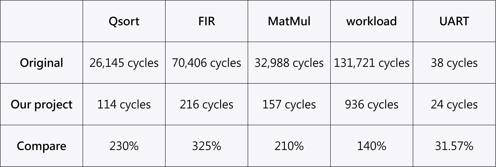
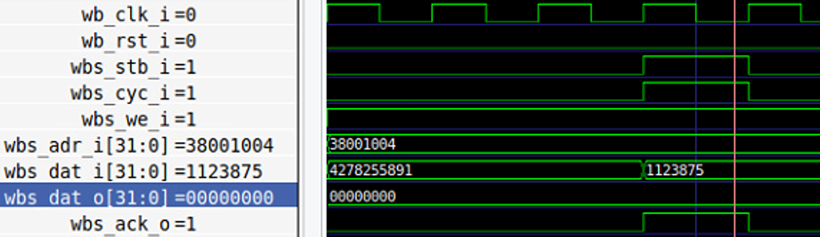
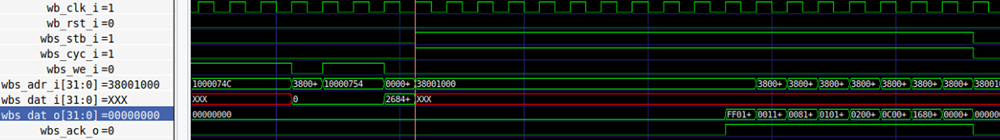
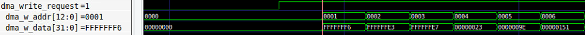
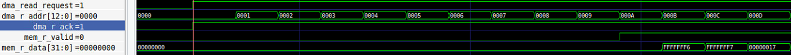
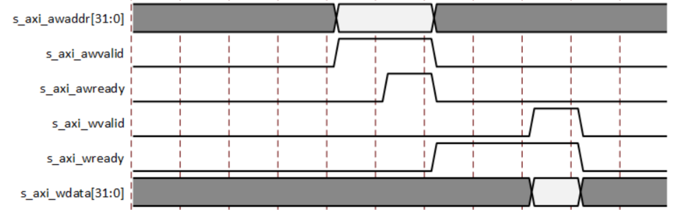
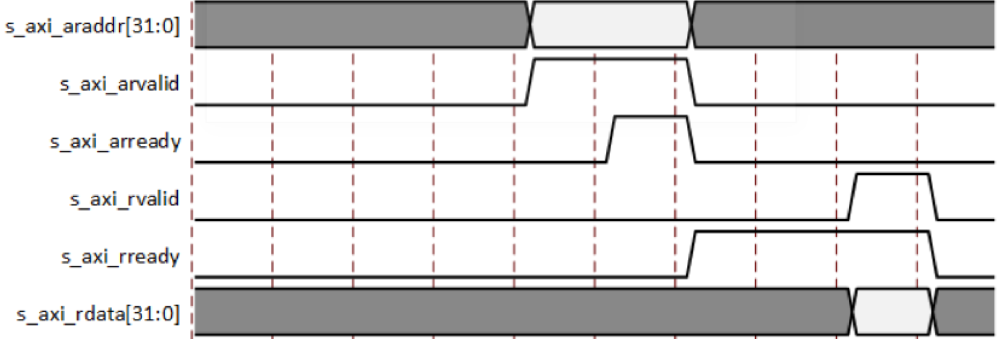

# 112 SOC Lab - Final Project


## Intro
### Course 
SoC Design
### Time
112 Autumn
### Team
07
### Memers
黃鉦淳 <br>
王語<br>
何佳玲<br>

### Powered by

[Caravel SoC](https://github.com/efabless/caravel?tab=readme-ov-file)


### Brief introdution
自修研發多個 IP 以及記憶體控制電路，並設計相應韌體，加速一系列任務需求。
研發項目
1. 以特化 IP 取代 CPU 完成複雜運算
2. 設計 DMA 讓特化 IP 可以直接訪問 Memory
3. 設計 Memory Arbiter
4. 優化韌體，降低外部記憶體訪問次數並增加硬體使用率
5. 設計 Data FIFO 與 prefetch 功能，作為 cache 使用。

task list
1. UART 
2. FIR 
3. Matrix multiply
4. Quick sorting


Acceleraor IP
1. Direct Memory Access(DMA) with AXI-stream protocol
2. Block RAM controller with AXI-stream protocol
3. Memory Arbiter
5. FIFO
6. Specialized IP for FIR, Matrix multiply, Quick sorting (ASIC in the picture below)

## Outline
- [112 SOC Lab - Final Project](#112-soc-lab---final-project)
  - [Intro](#intro)
    - [Course](#course)
    - [Time](#time)
    - [Team](#team)
    - [Memers](#Memers)
    - [Powerd by](#Powered-by)
    - [Brief introdution](#Brief-introdution)
  - [Outline](#outline)
  - [1. System](#1-system)
    - [1.1 Data Flow](#11-data-flow)
    - [1.2 Performance](#12-performance)
    - [1.3 Firmware](#13-firmware)
  - [2. Simulation](#2-simulation)
    - [2.1 RTL](#21-rtl)
  - [3. Result](#3-result)
    - [3.1 Simulation](#31-simulation)
    - [3.2 Waveform](#32-waveform)
      - [3.2.1 CPU - Write](#321-cpu---write)
      - [3.2.2 CPU - Read](#322-cpu---read)
      - [3.2.3 DMA - Write](#323-dma---write)
      - [3.2.4 DMA - Read](#324-dma---read)
  - [4. About Project](#4-about-project)
    - [4.1 Memory Map](#41-memory-map)
    - [4.2 Checkbits](#42-checkbits)
    - [4.3 DMA Config](#43-dma-config)
    - [4.4 UART Config](#44-uart-config)
    - [4.4 Linker Script](#44-linker-script)
    - [4.5 Arbiter Priority](#45-arbiter-priority)
    - [4.6 Transfer Protocol](#46-transfer-protocol)
      - [4.6.0 Naming Abbreviation](#460-naming-abbreviation)
      - [4.6.1 DMA/brc0](#461-dmabrc0)
      - [4.6.2 DMA/ASIC](#462-dmaasic)
  - [5. Report](#5-report)
  - [6. Youtube](#6-youtube)

## 1. System
### 1.1 Data Flow

### 1.2 Performance

### 1.3 Firmware
``` c
int main() {
    // mprj_init
    // la_init
    // uart_interrupt_init
    // apply_config
    for(int i = 0; i < TIMES_RERUN; i++) {
		// Workload
		fir(); matmul(); qsort();
		// Workload_check
		fir_check(); matmul_check(); qsort_check();
	}
}
```

## 2. Simulation
### 2.1 RTL
1. generate project firmware and simulation on vivado
    ``` bash
      cd ~/testbench
      make
    ```

<!-- ### 2.2 Synthesis/Implementation
1. generate bitstream/hardware handoff files
    ``` bash
    cd ~/vivado
    make
    ```
2. upload files on online FPGA
    ``` bash
    cp ./vivado/jupyter_notebook/* onlineFPGA
    # Run caravel_fpga.ipynb
    ```  -->

## 3. Result
### 3.1 Simulation
``` text
make[1]: Entering directory '~/testbench'
make[1]: Leaving directory '~/testbench'
Reading main.hex
main.hex loaded into memory
Memory 5 bytes = 0x6f 0x00 0x00 0x0b 0x13
VCD info: dumpfile main.vcd opened for output.
Times = 1/1 - UART
Times = 1/1 - Hardware(check)
Times = 1/1 - Hardware
tx_data[0] = 1'b0
tx_data[1] = 1'b0
tx_data[2] = 1'b0
tx_data[3] = 1'b0
tx_data[4] = 1'b0
tx_data[5] = 1'b0
tx_data[6] = 1'b0
tx_data[7] = 1'b0
tx complete - data: 8'd000, 8'h00
Test start - FIR
Test end   - FIR
Test start - matmul
Test end   - matmul
Test start - qsort
Test end   - qsort
Test check start - FIR
ans[31:16] =      0, golden ans[31:16] =      0
ans[15:0]  =      0, golden ans[15:0]  =      0
FIR passed - pattern # 0
ans[31:16] =  65535, golden ans[31:16] =  65535
ans[15:0]  =  65526, golden ans[15:0]  =  65526
FIR passed - pattern # 1
ans[31:16] =  65535, golden ans[31:16] =  65535
ans[15:0]  =  65507, golden ans[15:0]  =  65507
FIR passed - pattern # 2
ans[31:16] =  65535, golden ans[31:16] =  65535
ans[15:0]  =  65511, golden ans[15:0]  =  65511
FIR passed - pattern # 3
ans[31:16] =      0, golden ans[31:16] =      0
ans[15:0]  =     35, golden ans[15:0]  =     35
FIR passed - pattern # 4
ans[31:16] =      0, golden ans[31:16] =      0
ans[15:0]  =    158, golden ans[15:0]  =    158
FIR passed - pattern # 5
ans[31:16] =      0, golden ans[31:16] =      0
ans[15:0]  =    337, golden ans[15:0]  =    337
FIR passed - pattern # 6
ans[31:16] =      0, golden ans[31:16] =      0
ans[15:0]  =    539, golden ans[15:0]  =    539
FIR passed - pattern # 7
ans[31:16] =      0, golden ans[31:16] =      0
ans[15:0]  =    732, golden ans[15:0]  =    732
FIR passed - pattern # 8
ans[31:16] =      0, golden ans[31:16] =      0
ans[15:0]  =    915, golden ans[15:0]  =    915
FIR passed - pattern # 9
ans[31:16] =      0, golden ans[31:16] =      0
ans[15:0]  =   1098, golden ans[15:0]  =   1098
FIR passed - pattern #10
ans[31:16] =      0, golden ans[31:16] =      0
ans[15:0]  =   1281, golden ans[15:0]  =   1281
FIR passed - pattern #11
ans[31:16] =      0, golden ans[31:16] =      0
ans[15:0]  =   1464, golden ans[15:0]  =   1464
FIR passed - pattern #12
ans[31:16] =      0, golden ans[31:16] =      0
ans[15:0]  =   1647, golden ans[15:0]  =   1647
FIR passed - pattern #13
ans[31:16] =      0, golden ans[31:16] =      0
ans[15:0]  =   1830, golden ans[15:0]  =   1830
FIR passed - pattern #14
ans[31:16] =      0, golden ans[31:16] =      0
ans[15:0]  =   2013, golden ans[15:0]  =   2013
FIR passed - pattern #15
ans[31:16] =      0, golden ans[31:16] =      0
ans[15:0]  =   2196, golden ans[15:0]  =   2196
FIR passed - pattern #16
ans[31:16] =      0, golden ans[31:16] =      0
ans[15:0]  =   2379, golden ans[15:0]  =   2379
FIR passed - pattern #17
ans[31:16] =      0, golden ans[31:16] =      0
ans[15:0]  =   2562, golden ans[15:0]  =   2562
FIR passed - pattern #18
ans[31:16] =      0, golden ans[31:16] =      0
ans[15:0]  =   2745, golden ans[15:0]  =   2745
FIR passed - pattern #19
ans[31:16] =      0, golden ans[31:16] =      0
ans[15:0]  =   2928, golden ans[15:0]  =   2928
FIR passed - pattern #20
ans[31:16] =      0, golden ans[31:16] =      0
ans[15:0]  =   3111, golden ans[15:0]  =   3111
FIR passed - pattern #21
ans[31:16] =      0, golden ans[31:16] =      0
ans[15:0]  =   3294, golden ans[15:0]  =   3294
FIR passed - pattern #22
ans[31:16] =      0, golden ans[31:16] =      0
ans[15:0]  =   3477, golden ans[15:0]  =   3477
FIR passed - pattern #23
ans[31:16] =      0, golden ans[31:16] =      0
ans[15:0]  =   3660, golden ans[15:0]  =   3660
FIR passed - pattern #24
ans[31:16] =      0, golden ans[31:16] =      0
ans[15:0]  =   3843, golden ans[15:0]  =   3843
FIR passed - pattern #25
ans[31:16] =      0, golden ans[31:16] =      0
ans[15:0]  =   4026, golden ans[15:0]  =   4026
FIR passed - pattern #26
ans[31:16] =      0, golden ans[31:16] =      0
ans[15:0]  =   4209, golden ans[15:0]  =   4209
FIR passed - pattern #27
ans[31:16] =      0, golden ans[31:16] =      0
ans[15:0]  =   4392, golden ans[15:0]  =   4392
FIR passed - pattern #28
ans[31:16] =      0, golden ans[31:16] =      0
ans[15:0]  =   4575, golden ans[15:0]  =   4575
FIR passed - pattern #29
ans[31:16] =      0, golden ans[31:16] =      0
ans[15:0]  =   4758, golden ans[15:0]  =   4758
FIR passed - pattern #30
ans[31:16] =      0, golden ans[31:16] =      0
ans[15:0]  =   4941, golden ans[15:0]  =   4941
FIR passed - pattern #31
ans[31:16] =      0, golden ans[31:16] =      0
ans[15:0]  =   5124, golden ans[15:0]  =   5124
FIR passed - pattern #32
ans[31:16] =      0, golden ans[31:16] =      0
ans[15:0]  =   5307, golden ans[15:0]  =   5307
FIR passed - pattern #33
ans[31:16] =      0, golden ans[31:16] =      0
ans[15:0]  =   5490, golden ans[15:0]  =   5490
FIR passed - pattern #34
ans[31:16] =      0, golden ans[31:16] =      0
ans[15:0]  =   5673, golden ans[15:0]  =   5673
FIR passed - pattern #35
ans[31:16] =      0, golden ans[31:16] =      0
ans[15:0]  =   5856, golden ans[15:0]  =   5856
FIR passed - pattern #36
ans[31:16] =      0, golden ans[31:16] =      0
ans[15:0]  =   6039, golden ans[15:0]  =   6039
FIR passed - pattern #37
ans[31:16] =      0, golden ans[31:16] =      0
ans[15:0]  =   6222, golden ans[15:0]  =   6222
FIR passed - pattern #38
ans[31:16] =      0, golden ans[31:16] =      0
ans[15:0]  =   6405, golden ans[15:0]  =   6405
FIR passed - pattern #39
ans[31:16] =      0, golden ans[31:16] =      0
ans[15:0]  =   6588, golden ans[15:0]  =   6588
FIR passed - pattern #40
ans[31:16] =      0, golden ans[31:16] =      0
ans[15:0]  =   6771, golden ans[15:0]  =   6771
FIR passed - pattern #41
ans[31:16] =      0, golden ans[31:16] =      0
ans[15:0]  =   6954, golden ans[15:0]  =   6954
FIR passed - pattern #42
ans[31:16] =      0, golden ans[31:16] =      0
ans[15:0]  =   7137, golden ans[15:0]  =   7137
FIR passed - pattern #43
ans[31:16] =      0, golden ans[31:16] =      0
ans[15:0]  =   7320, golden ans[15:0]  =   7320
FIR passed - pattern #44
ans[31:16] =      0, golden ans[31:16] =      0
ans[15:0]  =   7503, golden ans[15:0]  =   7503
FIR passed - pattern #45
ans[31:16] =      0, golden ans[31:16] =      0
ans[15:0]  =   7686, golden ans[15:0]  =   7686
FIR passed - pattern #46
ans[31:16] =      0, golden ans[31:16] =      0
ans[15:0]  =   7869, golden ans[15:0]  =   7869
FIR passed - pattern #47
ans[31:16] =      0, golden ans[31:16] =      0
ans[15:0]  =   8052, golden ans[15:0]  =   8052
FIR passed - pattern #48
ans[31:16] =      0, golden ans[31:16] =      0
ans[15:0]  =   8235, golden ans[15:0]  =   8235
FIR passed - pattern #49
ans[31:16] =      0, golden ans[31:16] =      0
ans[15:0]  =   8418, golden ans[15:0]  =   8418
FIR passed - pattern #50
ans[31:16] =      0, golden ans[31:16] =      0
ans[15:0]  =   8601, golden ans[15:0]  =   8601
FIR passed - pattern #51
ans[31:16] =      0, golden ans[31:16] =      0
ans[15:0]  =   8784, golden ans[15:0]  =   8784
FIR passed - pattern #52
ans[31:16] =      0, golden ans[31:16] =      0
ans[15:0]  =   8967, golden ans[15:0]  =   8967
FIR passed - pattern #53
ans[31:16] =      0, golden ans[31:16] =      0
ans[15:0]  =   9150, golden ans[15:0]  =   9150
FIR passed - pattern #54
ans[31:16] =      0, golden ans[31:16] =      0
ans[15:0]  =   9333, golden ans[15:0]  =   9333
FIR passed - pattern #55
ans[31:16] =      0, golden ans[31:16] =      0
ans[15:0]  =   9516, golden ans[15:0]  =   9516
FIR passed - pattern #56
ans[31:16] =      0, golden ans[31:16] =      0
ans[15:0]  =   9699, golden ans[15:0]  =   9699
FIR passed - pattern #57
ans[31:16] =      0, golden ans[31:16] =      0
ans[15:0]  =   9882, golden ans[15:0]  =   9882
FIR passed - pattern #58
ans[31:16] =      0, golden ans[31:16] =      0
ans[15:0]  =  10065, golden ans[15:0]  =  10065
FIR passed - pattern #59
ans[31:16] =      0, golden ans[31:16] =      0
ans[15:0]  =  10248, golden ans[15:0]  =  10248
FIR passed - pattern #60
ans[31:16] =      0, golden ans[31:16] =      0
ans[15:0]  =  10431, golden ans[15:0]  =  10431
FIR passed - pattern #61
ans[31:16] =      0, golden ans[31:16] =      0
ans[15:0]  =  10614, golden ans[15:0]  =  10614
FIR passed - pattern #62
ans[31:16] =      0, golden ans[31:16] =      0
ans[15:0]  =  10797, golden ans[15:0]  =  10797
FIR passed - pattern #63
Test check end   - FIR
Test check start - matmul
ans = 62, golden ans = 62
matmul passed - pattern #00
ans = 68, golden ans = 68
matmul passed - pattern #01
ans = 74, golden ans = 74
matmul passed - pattern #02
ans = 80, golden ans = 80
matmul passed - pattern #03
ans = 62, golden ans = 62
matmul passed - pattern #04
ans = 68, golden ans = 68
matmul passed - pattern #05
ans = 74, golden ans = 74
matmul passed - pattern #06
ans = 80, golden ans = 80
matmul passed - pattern #07
ans = 62, golden ans = 62
matmul passed - pattern #08
ans = 68, golden ans = 68
matmul passed - pattern #09
ans = 74, golden ans = 74
matmul passed - pattern #10
ans = 80, golden ans = 80
matmul passed - pattern #11
ans = 62, golden ans = 62
matmul passed - pattern #12
ans = 68, golden ans = 68
matmul passed - pattern #13
ans = 74, golden ans = 74
matmul passed - pattern #14
ans = 80, golden ans = 80
matmul passed - pattern #15
Test check end   - matmul
Test check start - qsort
ans =   40, golden ans =   40
qsort passed - pattern #0
ans =  893, golden ans =  893
qsort passed - pattern #1
ans = 2541, golden ans = 2541
qsort passed - pattern #2
ans = 2669, golden ans = 2669
qsort passed - pattern #3
ans = 3233, golden ans = 3233
qsort passed - pattern #4
ans = 4267, golden ans = 4267
qsort passed - pattern #5
ans = 4622, golden ans = 4622
qsort passed - pattern #6
ans = 5681, golden ans = 5681
qsort passed - pattern #7
ans = 6023, golden ans = 6023
qsort passed - pattern #8
ans = 9073, golden ans = 9073
qsort passed - pattern #9
Test check end   - qsort
main_tb.v:88: $finish called at 3251237500 (1ps)
```

### 3.2 Waveform
#### 3.2.1 CPU - Write

#### 3.2.2 CPU - Read

#### 3.2.3 DMA - Write

#### 3.2.4 DMA - Read


## 4. About Project
### 4.1 Memory Map 
|  Base   |   End   |   Hardware   |    Description    |
|---------|---------|--------------|-------------------|
|3800_0000|3800_04FF|BRAM_u0       |Initialized datas  |
|3800_1000|3800_1FFF|BRAM_u0       |RISC-V Instructions|
|3800_7000|3800_7FFF|BRAM_u1       |Calculated Result  |
|3000_8000|3000_8000|DMA_Controller|DMA_cfg            |
|3000_8004|3000_8004|DMA_Controller|DMA_addr           |
|3100_0000|3100_0000|uart_ctrl     |RX_DATA            |
|3100_0004|3100_0004|uart_ctrl     |TX_DATA            |
|3100_0008|3100_0008|uart_ctrl     |STAT_REG           |


### 4.2 Checkbits
``` verilog
  // ~/testbench/main_tb.v
  assign checkbits = mprj_io[31:16];
```

|checkbits|Hardware|Meaning                                               |
|---------|--------|------------------------------------------------------|
|16'hAB00 |FIR     |testbench has received CPU - FIR start signal         |
|16'hAB01 |FIR     |testbench has received CPU - FIR end signal           |
|16'hAB10 |matmul  |testbench has received CPU - matmul start signal      |
|16'hAB11 |matmul  |testbench has received CPU - matmul end signal        |
|16'hAB20 |qsort   |testbench has received CPU - qsort start signal       |
|16'hAB21 |qsort   |testbench has received CPU - qsort end signal         |
|16'hAB30 |FIR     |testbench has received CPU - FIR_check start signal   |
|16'hAB31 |FIR     |testbench has received CPU - FIR_check end signal     |
|16'hAB40 |matmul  |testbench has received CPU - matmul_check start signal|
|16'hAB41 |matmul  |testbench has received CPU - matmul_check end signal  |
|16'hAB50 |qsort   |testbench has received CPU - qsort_check start signal |
|16'hAB51 |qsort   |testbench has received CPU - qsort_check end signal   |


### 4.3 DMA Config
``` text
         +------+------+-------+------+---------+--------+
DMA_cfg  | done | idle | start | type | channel | length |
         | [12] | [11] | [10]  | [9]  |  [8:7]  |  [6:0] |
         +------+------+-------+------+---------+--------+
DMA_addr |                addr_DMA2RAM                   |
         |                   [12:0]                      |
         +-----------------------------------------------+
```
### 4.4 UART Config
``` 
         +-------------------------------------------------------------------+
RX_DATA  |                             DATA BITS                             |
         |                               [7:0]                               |
         +-------------------------------------------------------------------+
TX_DATA  |                             DATA BITS                             |
         |                               [7:0]                               |
         +-----------+-------------+---------+----------+---------+----------+
STAT_REG | Frame Err | Overrun Err | Tx_full | Tx_empty | Rx_full | Rx_empty |
         |    [5]    |     [4]     |   [3]   |   [2]    |   [1]   |   [0]    |
         +-----------+-------------+---------+----------+---------+----------+
```

### 4.4 Linker Script
File : [Linker Script](./firmware/sections.lds)
``` linker-script
MEMORY {
	vexriscv_debug : ORIGIN = 0xf00f0000, LENGTH = 0x00000100
	dff            : ORIGIN = 0x00000000, LENGTH = 0x00000400
	dff2           : ORIGIN = 0x00000400, LENGTH = 0x00000200
	flash          : ORIGIN = 0x10000000, LENGTH = 0x01000000
	mprj           : ORIGIN = 0x31000000, LENGTH = 0x00100000
	rawdata        : ORIGIN = 0x38000000, LENGTH = 0x00000500
	mprjram        : ORIGIN = 0x38001000, LENGTH = 0x00001000
	hk             : ORIGIN = 0x26000000, LENGTH = 0x00100000
	csr            : ORIGIN = 0xf0000000, LENGTH = 0x00010000
}
```

### 4.5 Arbiter Priority
> BRAM_u0 & BRAM_u1 do not concurrent working!

|Priority|BRAM_u0       |BRAM_u1    |
|--------|--------------|-----------|
|Highest |CPU (Write)   |DMA (Write)|
|        |CPU (Prefetch)|CPU (Read) |
|        |DMA (Read)    |           |
|Lowest  |CPU (Read)    |           |

### 4.6 Transfer Protocol
#### 4.6.0 Naming Abbreviation
  - dma  : DMA controller
  - brc0 : BRAM controller u0 
  - brc1 : BRAM controller u1 
  - abt  : Arbiter
  - d0   : data0
  - d1   : data1
  - a0   : addr0
  - a1   : addr1

#### 4.6.1 DMA/brc0
1. DMA Read data from BRAM_u0
    > BRAM controller u0 -> DMA controller

   -  Arbiter is idle
   ``` text
                   0  1  2  3  4  5  6  7  8  9 10 11 12 13 14 15 16 17 18 19 20 21 22 23 24 25
   clk             |  |  |  |  |  |  |  |  |  |  |  |  |  |  |  |  |  |  |  |  |  |  |  |  |  |
   dma_r_addr      ___/a0|a1|a2|a3|a4|a5|a6|a7|a8|a9|aA|aB\____________________________________
   dma_r_ready     ___/‾‾‾‾‾‾‾‾‾‾‾‾‾‾‾‾‾‾‾‾‾‾‾‾‾‾‾‾‾‾‾‾‾‾‾\____________________________________
   abt_r_ack       ___/‾‾‾‾‾‾‾‾‾‾‾‾‾‾‾‾‾‾‾‾‾‾‾‾‾‾‾‾‾‾‾‾‾‾‾\____________________________________
   brc0_out_valid  _________________________________/‾‾‾‾‾‾‾‾‾‾‾‾‾‾‾‾‾‾‾‾‾‾‾‾‾‾‾‾‾‾‾‾‾‾‾\______     
   brc0_data_out   _________________________________/d0|d1|d2|d3|d4|d5|d6|d7|d8|d9|dA|dB\______
                     |<-----------10T------------->|
   minimun latency : 10T
   < if add a cache at DMA can reduce the latency to 1T , maybe could implement 0T ! >
   ```

   -  Arbiter is busy
   ``` text
                   0  1  2  3  4  5  6  7  8  9 10 11 12 13 14 15 16 17 18 19 20 21 22 23 24 25
   clk             |  |  |  |  |  |  |  |  |  |  |  |  |  |  |  |  |  |  |  |  |  |  |  |  |  |
   dma_r_addr      ___/‾a0‾‾|a1|a2|a3|a4|a5|a6|a7|a8|a9|aA|aB\_________________________________
   dma_r_ready     ___/‾‾‾‾‾‾‾‾‾‾‾‾‾‾‾‾‾‾‾‾‾‾‾‾‾‾‾‾‾‾‾‾‾‾‾‾‾‾\_________________________________
   abt_r_ack       _________/‾‾‾‾‾‾‾‾‾‾‾‾‾‾‾‾‾‾‾‾‾‾‾‾‾‾‾‾‾‾‾‾\_________________________________
   brc0_out_valid  _______________________________________/‾‾‾‾‾‾‾‾‾‾‾‾‾‾‾‾‾‾‾‾‾‾‾‾‾‾‾‾‾‾‾‾‾‾‾\    
   brc0_data_out   _______________________________________/d0|d1|d2|d3|d4|d5|d6|d7|d8|d9|dA|dB\
                           |<-----------10T------------->|
   ```

   -  Interrupt by cpu
   ```
                   0  1  2  3  4  5  6  7  8  9 10 11 12 13 14 15 16 17 18 19 20 21 22 23 24 25 26
   clk             |  |  |  |  |  |  |  |  |  |  |  |  |  |  |  |  |  |  |  |  |  |  |  |  |  |  |
   dma_r_addr      ___/‾a0‾‾|a1|a2|a3|a4|a5|‾a6‾‾|a7|a8|a9|aA|aB\_________________________________
   dma_r_ready     ___/‾‾‾‾‾‾‾‾‾‾‾‾‾‾‾‾‾‾‾‾‾‾‾‾‾‾‾‾‾‾‾‾‾‾‾‾‾‾‾‾‾\_________________________________
   abt_r_ack       _________/‾‾‾‾‾‾‾‾‾‾‾‾‾‾\__/‾‾‾‾‾‾‾‾‾‾‾‾‾‾‾‾‾\_________________________________
   brc0_out_valid  _______________________________________/‾‾‾‾‾‾‾‾‾‾‾‾‾‾‾‾‾\__/‾‾‾‾‾‾‾‾‾‾‾‾‾‾‾‾‾\    
   brc0_data_out   _______________________________________/d0|d1|d2|d3|d4|d5|xx|d6|d7|d8|d9|dA|dB\
                           |<-----------10T------------->|
   ```
2. DMA Write data to BRAM_u1
    > DMA controller -> BRAM controller u1
  - DMA is the highest priority of Arbiter
  ```
                  0  1  2  3  4  5  6  7  8  9 10 11 12 13 14 15
  clk             |  |  |  |  |  |  |  |  |  |  |  |  |  |  |  |
  dma_w_addr      ___/‾‾‾‾‾‾‾‾‾‾‾‾‾‾‾‾‾‾‾‾‾‾‾‾‾‾‾‾‾‾‾‾‾‾‾\______
  dma_w_valid     ___/‾‾‾‾‾‾‾‾‾‾‾‾‾‾‾‾‾‾‾‾‾‾‾‾‾‾‾‾‾‾‾‾‾‾‾\______     
  dma_w_data      ___/d0|d1|d2|d3|d4|d5|d6|d7|d8|d9|dA|dB\______
  latency : 0T
  ```

#### 4.6.2 DMA/ASIC
- AXI-Lite (Write)

- AXI-Lite (Read)


## 5. Report
[Report - SoC Final Project #07 - pdf](./report/report_soc_final_07.pdf)

## 6. Youtube
[SOC Lab - Final Project (Team#07) - Youtube](https://youtu.be/Cj6Op68bTSg)
