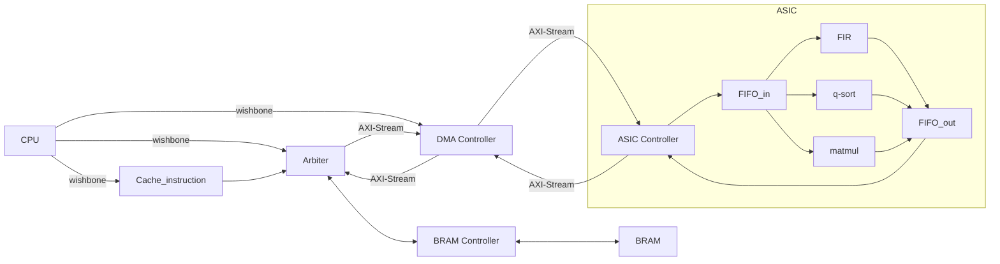

# 112 SOC Lab - Final Project


## System Architecture


## System Data Flow


## Simulation RTL
1. generate project firmware and simulation on vivado
    ``` bash
      cd ~/testbench
      make
    ```

## Simulation on FPGA
1. generate bitstream/hardware handoff files
    ``` bash
    cd ~/vivado
    make
    ```

## Simulation Result
- Command Line
    ``` bash
    make[1]: Entering directory '~/testbench'
    make[1]: Leaving directory '~/testbench'
    Reading main.hex
    main.hex loaded into memory
    Memory 5 bytes = 0x6f 0x00 0x00 0x0b 0x13
    VCD info: dumpfile main.vcd opened for output.
    Times = 1/3 - UART
    Times = 1/3 - Hardware
    tx_data[0] = 1'b0
    tx_data[1] = 1'b0
    tx_data[2] = 1'b0
    tx_data[3] = 1'b0
    tx_data[4] = 1'b0
    tx_data[5] = 1'b0
    tx_data[6] = 1'b0
    tx_data[7] = 1'b0
    tx complete - data: 8'd000, 8'h00
    Times = 2/3 - UART
    tx_data[0] = 1'b1
    tx_data[1] = 1'b0
    Test start - FIR
    Test end   - FIR
    Test start - matmul
    tx_data[2] = 1'b0
    Test end   - matmul
    Test start - qsort
    Test end   - qsort
    Times = 2/3 - Hardware
    tx_data[3] = 1'b0
    Test start - FIR
    Test end   - FIR
    Test start - matmul
    Test end   - matmul
    Test start - qsort
    tx_data[4] = 1'b0
    Test end   - qsort
    Times = 3/3 - Hardware
    Test start - FIR
    tx_data[5] = 1'b0
    Test end   - FIR
    Test start - matmul
    Test end   - matmul
    Test start - qsort
    tx_data[6] = 1'b0
    Test end   - qsort
    tx_data[7] = 1'b0
    tx complete - data: 8'd001, 8'h01
    Times = 3/3 - UART
    tx_data[0] = 1'b0
    tx_data[1] = 1'b1
    tx_data[2] = 1'b0
    tx_data[3] = 1'b0
    tx_data[4] = 1'b0
    tx_data[5] = 1'b0
    tx_data[6] = 1'b0
    tx_data[7] = 1'b0
    tx complete - data: 8'd002, 8'h02
    main_tb.v:80: $finish called at 3593727000 (1ps)
    ```
- Waveform
## About This Project
### Memory Map 
|  Base   |   End   |   Hardware   |                  Description                 |
|---------|---------|--------------|----------------------------------------------|
|3800_0000|3800_04FF|BRAM_u0       |Initialized datas                             |
|3800_1000|3800_1FFF|BRAM_u0       |RISC-V Instructions                           |
|3800_7000|3800_7FFF|BRAM_u1       |Calculated Result                             |
|3000_8000|3000_8000|DMA_Controller|DMA_cfg                                       |
|3000_8004|3000_8004|DMA_Controller|DMA_addr                                      |
|3100_0000|3100_0000|uart_ctrl     |RX_DATA                                       |
|3100_0004|3100_0004|uart_ctrl     |TX_DATA                                       |
|3100_0008|3100_0008|uart_ctrl     |STAT_REG                                      |


### Checkbits
``` verilog
  assign checkbits = mprj_io[31:16];
```

|checkbits|Hardware|Meaning                                               |
|:-------:|:------:|------------------------------------------------------|
|16'hAB00 |FIR     |testbench has received CPU - FIR start signal         |
|16'hAB01 |FIR     |testbench has received CPU - FIR end signal           |
|16'hAB10 |matmul  |testbench has received CPU - matmul start signal      |
|16'hAB11 |matmul  |testbench has received CPU - matmul end signal        |
|16'hAB20 |qsort   |testbench has received CPU - qsort start signal       |
|16'hAB21 |qsort   |testbench has received CPU - qsort end signal         |
|16'hAB30 |FIR     |testbench has received CPU - FIR_check start signal   |
|16'hAB31 |FIR     |testbench has received CPU - FIR_check end signal     |
|16'hAB40 |matmul  |testbench has received CPU - matmul_check start signal|
|16'hAB41 |matmul  |testbench has received CPU - matmul_check end signal  |
|16'hAB50 |qsort   |testbench has received CPU - qsort_check start signal |
|16'hAB51 |qsort   |testbench has received CPU - qsort_check end signal   |


### DMA Config
```
          +------+------+-------+------+---------+--------+
  DMA_cfg |      |      |       |      |         |        |
          | done | idle | start | type | channel | length |
 38008000 |      |      |       |      |         |        |
          +------+------+-------+------+---------+--------+
            [12]   [11]   [10]     [9]    [8:7]     [6:0]
 
 
          +--------------------------------+--------------+
 DMA_addr |                                |              |
          |                                | addr_DMA2RAM |
 38008004 |                                |              |
          +--------------------------------+--------------+
                                                 [12:0]
```
### UART Config
```
+------+-------+-------+-------+-------+-------+-------+-------+-------+-------+-------+
|RX_DATA |  RESERVERD  |                        DATA BITS                              |
|        |    31-8     |  7    |  6    |  5    |  4    |  3    |  2    |  1    |  0    |
+------+-------+-------+-------+-------+-------+-------+-------+-------+-------+-------+
|TX_DATA |  RESERVERD  |                        DATA BITS                              |
|        |    31-8     |  7    |  6    |  5    |  4    |  3    |  2    |  1    |  0    |
+------+-------+-------+-------+-------+-------+-------+-------+-------+-------+-------+-------+-------+
|STAT_REG|  RESERVERD  |  Frame Err  |  Overrun Err  |  Tx_full  |  Tx_empty  |  Rx_full  |  Rx_empty |
|        |    31-6     |  5          |  4            |  3        |  2         |  1        |  0        |
+------+-------+-------+-------+-------+-------+-------+-------+-------+-------+-------+-------+-------+
```

### Linker Script
``` 
.mprjram: origin : 0x3800_0500 , length : 6500
.data: origin : 0x3800_0000 , lenght : 500
```

### Transfer Protocol
#### BRAM Controller u0 -> DMA

#### DMA -> BRAM Controller u0 

#### DMA -> ASIC

#### ASIC -> DMA

