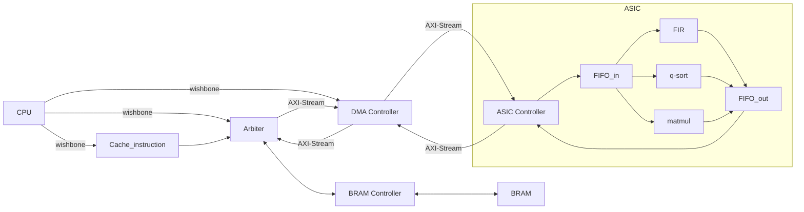

# 112 SOC Lab - Final Project


## System Architecture


## System Architecture


## Simulation
``` bash
cd ~/testbench
make
```

## IRQ
- IRQ0 - UART Receive 
- IRQ1 - DMA Controller isTaskDone (1=done, pulse for 1T)

## Simulation Result

## About This Project
### Memory Map 

### Transfer Protocol

### Linker Script
